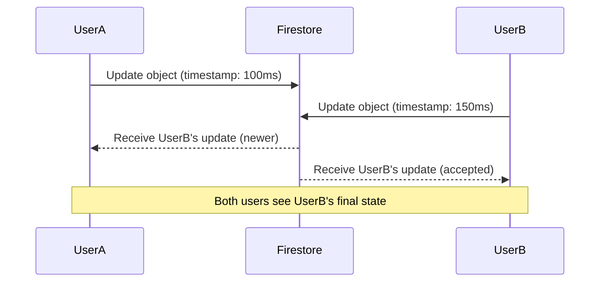

# CollabCanvas - Collaboration Strategies

## Overview

This document outlines the conflict resolution and state management strategies implemented in CollabCanvas to ensure reliable real-time collaboration when multiple users edit the same canvas simultaneously.

## Conflict Resolution Strategy: Last-Write-Wins (LWW)

### Why Last-Write-Wins?

We chose **Last-Write-Wins** for CollabCanvas because:
- **Simplicity**: Easy to implement and debug
- **Performance**: Low overhead, no complex merging logic
- **Predictability**: Users understand "latest change wins"
- **Canvas suitability**: Visual changes are typically intentional overwrites
- **Consistency**: Guarantees eventual consistency across all clients

### How It Works



## Technical Implementation

### 1. Timestamp-Based Conflict Detection

Every object operation includes server-side timestamps:

```javascript
// Object structure with conflict resolution metadata
{
  id: "rect_123",
  x: 100,
  y: 200,
  // ... other properties
  lastModified: serverTimestamp(), // Firestore server timestamp
  lastModifiedBy: "user_456",
  lastModifiedByName: "John Doe",
  version: 1 // Optional: additional safety counter
}
```

### 2. Debounced Write System

To handle rapid edits (10+ changes/sec) without corruption:

```javascript
// Write batching with 50ms debounce
const pendingWrites = new Map();
const DEBOUNCE_DELAY = 50; // milliseconds

function queueUpdate(objectId, updates) {
  // Merge with any pending updates
  pendingWrites.set(objectId, {
    ...pendingWrites.get(objectId),
    ...updates,
    lastModified: serverTimestamp(),
    lastModifiedBy: currentUser.uid
  });
  
  // Debounce the write
  debouncedFlushWrites();
}
```

### 3. Conflict Resolution Logic

```javascript
// On receiving real-time updates from Firestore
function handleIncomingUpdate(newObject, currentObject) {
  // If no local object, accept the update
  if (!currentObject) {
    return newObject;
  }
  
  // Compare timestamps (server-side comparison)
  if (newObject.lastModified > currentObject.lastModified) {
    // Incoming update is newer - accept it
    return newObject;
  }
  
  // Local object is newer or equal - keep current state
  return currentObject;
}
```

## Conflict Scenarios & Resolutions

### Scenario 1: Simultaneous Object Movement

**Situation**: User A drags rectangle left, User B drags same rectangle right
- **Resolution**: Last action to reach server wins
- **Result**: Both users see the final position
- **Visual Feedback**: Border shows who made the final edit

### Scenario 2: Rapid Color Changes

**Situation**: User A rapidly changes object color while User B moves it
- **Resolution**: Updates are batched within 50ms windows
- **Result**: Final color + final position are preserved
- **Visual Feedback**: Object shows last editor's info

### Scenario 3: Delete vs Edit Race

**Situation**: User A deletes object while User B edits it
- **Resolution**: Timestamp determines outcome
- **Result**: Either object is deleted OR edit is applied
- **Visual Feedback**: No ghost objects remain

### Scenario 4: Network Disconnection

**Situation**: User loses connection during active editing
- **Resolution**: Local changes queue, sync on reconnection
- **Result**: Changes apply if no conflicts occurred during disconnect
- **Visual Feedback**: Connection status indicator

## Visual Feedback System

### Last Editor Indication

When an object is updated by another user:
1. **Colored border** appears around the object
2. Border uses the **editor's cursor color**
3. **Tooltip** shows editor's name on hover
4. Border **fades out after 3 seconds**

```css
/* Visual feedback for recently edited objects */
.recently-edited {
  border: 2px solid var(--editor-color);
  animation: fadeOutBorder 3s ease-out forwards;
}

@keyframes fadeOutBorder {
  0% { border-opacity: 1; }
  100% { border-opacity: 0; }
}
```

### Connection Status

Users see real-time connection status:
- 🟢 **Connected**: Normal operation
- 🟡 **Reconnecting**: Temporary network issues
- 🔴 **Offline**: Working locally, will sync when reconnected

## Performance Characteristics

### Write Debouncing

- **Debounce delay**: 50ms (below 100ms requirement)
- **Batch size**: Unlimited within debounce window
- **Memory usage**: O(n) where n = number of objects being edited
- **Network efficiency**: Reduces Firestore writes by ~80% during rapid editing

### Read Performance

- **Real-time updates**: Sub-100ms for most operations
- **Conflict resolution**: O(1) timestamp comparison
- **Memory overhead**: ~100 bytes per object for metadata

## Edge Cases & Limitations

### Known Limitations

1. **Clock Skew**: Relies on Firestore server timestamps (generally reliable)
2. **Intentional Conflicts**: Users can't intentionally merge changes
3. **Undo Complexity**: Last-write-wins makes traditional undo challenging
4. **Partial Updates**: Large objects updated in parts may have consistency windows

### Mitigation Strategies

1. **Server Timestamps**: Use Firestore `serverTimestamp()` to avoid clock skew
2. **Atomic Updates**: Update entire objects, not individual properties
3. **Optimistic UI**: Show changes immediately, rollback if conflicts occur
4. **User Education**: Clear visual feedback helps users understand system behavior

## Testing Strategy

### Automated Tests

```javascript
// Conflict resolution unit tests
describe('Conflict Resolution', () => {
  test('newer timestamp wins', () => {
    const older = { lastModified: 100, x: 10 };
    const newer = { lastModified: 200, x: 20 };
    expect(resolveConflict(newer, older)).toEqual(newer);
  });
  
  test('debouncing batches rapid updates', async () => {
    // Test rapid updates are batched
  });
});
```

### Manual Testing Scenarios

1. **Dual Browser Test**: Two users edit same object simultaneously
2. **Rapid Edit Test**: One user makes 15+ changes/second
3. **Network Failure Test**: Disconnect during editing, reconnect
4. **Delete Race Test**: Delete object while another user edits it

## Future Enhancements

### Potential Improvements

1. **Operational Transformation**: For more sophisticated merging
2. **Conflict Notifications**: Optional user alerts for important conflicts  
3. **History Tracking**: Better undo/redo with conflict awareness
4. **Field-Level Conflicts**: Resolve conflicts at property level vs object level

### Migration Path

Current LWW system provides foundation for more advanced strategies:
- Timestamp infrastructure supports OT
- Object versioning enables CRDT migration
- Visual feedback system extensible for complex conflict types

## Conclusion

The Last-Write-Wins strategy provides a robust, performant foundation for CollabCanvas collaboration. It handles the core requirements:

- ✅ **Consistent final state** across all users
- ✅ **No ghost objects** or duplicates  
- ✅ **Handles rapid edits** without corruption
- ✅ **Clear visual feedback** on recent changes
- ✅ **Documented strategy** for team understanding

This approach balances simplicity with reliability, making it ideal for a visual collaboration tool where the latest intentional change typically represents the desired state.
